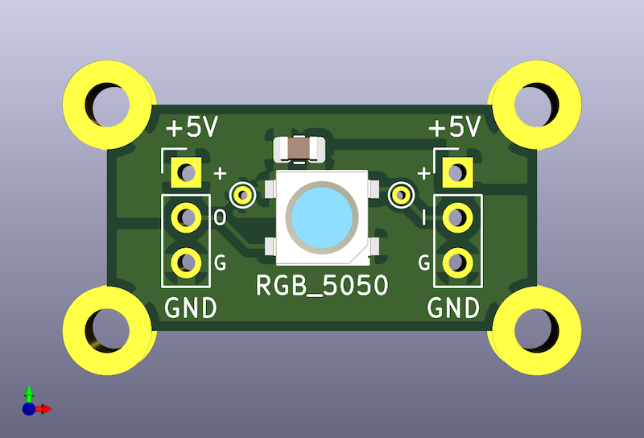

# RGB5050-mount

Revision 1.

A board for mounting [RGB 5050
LED](https://www.digikey.com/en/products/detail/inolux/IN-PI554FCH/7604874)s.

Note that the four things that are rendered as rings in the four corners are
actually cut as castellations on the board, so you can solder it down to power
rails like copper tape.

## Why

I am working on a [project](https://github.com/jed/window-tetris) that requires
a large number of RGB LEDs spread out at a social distance of about 3 inches
from each other. This board lets me do that easily.

## Prototyping

This design is also breadboard-friendly. The two rows of connections are 0.6
inches apart, so if you solder some headers into them, they will sit nicely on
a breadboard.

## Gerber Files

The gerber files are already exported in `export/gerber/` if you just want to
take them and go.

## BOM

- [5050
  LED](https://www.digikey.com/en/products/detail/inolux/IN-PI554FCH/7604874)
- 0.1μF 0803 ceramic capacitor

## License

Written by Jed Parsons. Distributed under the BSD license. Read `license.txt`
for details. All text above must be included in any redistribution.

